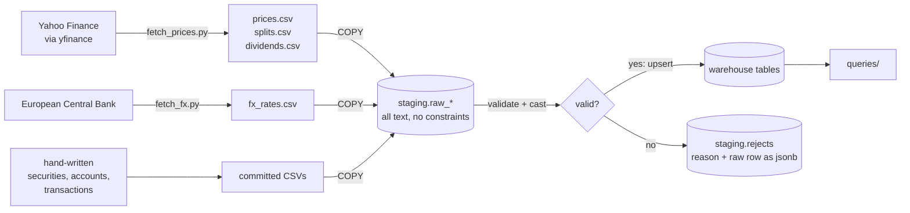
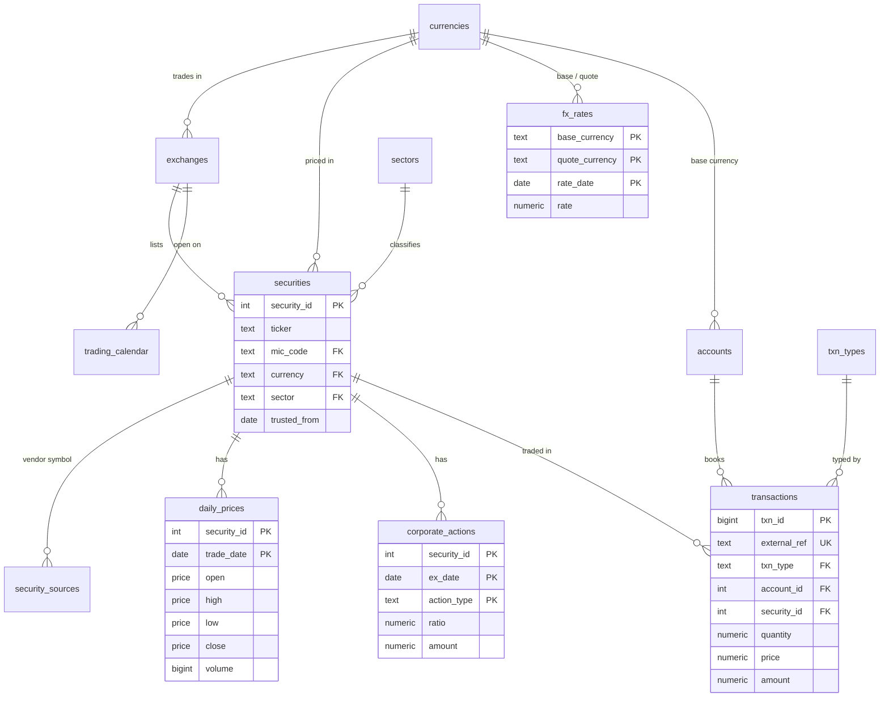

# Folio

[](https://github.com/arda-sahin0/Folio/actions/workflows/ci.yml)

A market-data and portfolio-analytics warehouse in **PostgreSQL 16**, built as a hands-on way to learn SQL in depth: schema design and constraints, idempotent loading, joins and aggregation, window functions, and (coming next) financial correctness, performance tuning and concurrency.

Everything is answered in SQL. Python only downloads the raw files.

> **Status:** work in progress. Milestones M0–M3 are done and M4 (window functions) is underway; see the [roadmap](#roadmap).

## At a glance

| | |
|---|---|
| Securities | 17 stocks across 10 sectors, listed on NYSE, Nasdaq and Xetra |
| Daily prices | 159,580 OHLCV bars, 1962 → today, stored as **actually traded** (not split-adjusted) |
| Corporate actions | 62 splits and 1,541 dividends |
| FX rates | 186,744 ECB euro reference rates for 30 currencies, 1999 → today |
| Data quality | 12,282 vendor rows rejected with a reason; every load reconciles to the row |
| Portfolio | a 52-transaction demo ledger (deposits, buys, sells, dividends, fees) |
| Tests | 34 constraint attacks, loader checks against hand-built fixtures, an idempotency proof, all run in CI on every push |

## How data flows



Each loader copies a file into an all-text staging table, gives every bad row a `reject_reason`, promotes the rest with `INSERT … ON CONFLICT`, and logs the rejects. Running a loader twice changes nothing.

## Schema



Rules live in the schema, not in application code: OHLC consistency (`high = greatest(open, high, low, close)`), a `price` domain that rejects zero and negatives, type-discriminated rows (a split must have a ratio and no amount; a buy must have quantity and price and no amount), an EUR-only FX base, and lookup tables that carry behaviour (`txn_types.cash_sign`).

## Quickstart (Windows, PowerShell)

Requires Docker Desktop and Python 3.13.

```powershell
Copy-Item .env.example .env                 # then set a password
.\scripts\reset.ps1                          # fresh database, all migrations
py -3.13 -m venv .venv
.\.venv\Scripts\Activate.ps1
python -m pip install -r requirements.txt
.\scripts\load.ps1 001_securities            # register the securities to download
python scripts\fetch_prices.py               # Yahoo: prices, splits, dividends
python scripts\fetch_fx.py                   # ECB: euro reference rates
.\scripts\load.ps1                           # run every loader
```

Connect with any client on `localhost:<POSTGRES_PORT>` and run the files in `queries/`.

## Highlights

**Finding fake crashes** ([`queries/m4/01_daily_returns.sql`](queries/m4/01_daily_returns.sql)). Close-to-close returns with `lag()` on raw prices make every split look like a crash. Scaling the close on each ex-date by that day's split ratio removes them, and real events appear:

| raw `lag()` | | | split-aware | | |
|---|---|---|---|---|---|
| AMZN | 2022-06-06 | −94.90 % | AAPL | 2000-09-29 | −51.87 % |
| NVDA | 2024-06-10 | −89.93 % | NVDA | 2004-08-06 | −35.23 % |
| AAPL | 2014-06-09 | −85.49 % | UNH | 1987-10-20 | −34.21 % |

**Maximum drawdown** ([`queries/m4/02_max_drawdown.sql`](queries/m4/02_max_drawdown.sql)). Growth rebuilt as `exp(sum(ln(1 + r)))` over a window, a running peak, the worst fall from it, and when (if ever) the peak was regained:

| ticker | max drawdown | peak | trough | recovered |
|---|---|---|---|---|
| AMZN | −94.4 % | 1999-12-10 | 2001-09-28 | 2009-10-23 |
| RWE | −90.8 % | 2008-01-07 | 2015-09-28 | not yet |
| NVDA | −89.7 % | 2002-01-03 | 2002-10-09 | 2006-11-13 |
| INTC | −83.9 % | 2000-08-31 | 2009-02-23 | 2026-04-24 |
| MSFT | −74.6 % | 1999-12-27 | 2009-03-09 | 2016-10-21 |

**Traded value across currencies** ([`queries/m3/01_most_traded.sql`](queries/m3/01_most_traded.sql)). Average daily traded value in 2025, converted to EUR with a `LEFT JOIN` to ECB rates. An anti-join shows the three NYSE sessions with no ECB fixing (Easter Monday, 1 May, 26 December).

| ticker | avg traded per day, 2025 |
|---|---|
| NVDA | €28.9 bn |
| AAPL | €11.0 bn |
| MSFT | €9.0 bn |
| AMZN | €8.5 bn |
| UNH | €3.5 bn |

Also in `queries/`: greatest-n-per-group with `DISTINCT ON` and with a join back, market breadth with `count(*) FILTER`, NYSE vs Xetra holidays with `EXCEPT` and `FULL JOIN`, the `NOT IN` NULL trap, missing sessions with correlated subqueries, and 50/200-day moving-average crosses with `ROWS` frames.

## Tests

`tests/run.sh` builds a fresh database from the migrations, loads [hand-built fixtures](tests/fixtures) **twice**, then:

- **`test_constraints.sql`**: 34 attempts to insert bad data (inverted OHLC, a split with a cash amount, a buy without a price, a non-EUR FX base, …), each of which must be rejected by the schema, plus 6 valid rows that must be accepted;
- **`test_loaders.sql`**: every fixture row exercises one rule (a bar before two splits must come back ×28, an impossible date `2020-13-01` must be rejected rather than crash the load, a placeholder holiday bar must be dropped), and staged rows must equal loaded plus rejected;
- **`test_idempotency.sql`**: an md5 fingerprint of every table after the first load must match the second;
- **`test_portfolio.sql`**: the ledger books all 52 transactions and implies the expected positions;
- every query in `queries/` must run without error.

GitHub Actions runs this on every push and pull request, along with unit tests for the FX reshaping in `scripts/fetch_fx.py`.

## Repository layout

```
migrations/   numbered, forward-only schema changes (applied once, in order)
loaders/      re-runnable data loads: staging -> validate -> upsert -> rejects
queries/      answers, one file per question, grouped by milestone
scripts/      reset.ps1, load.ps1, fetch_prices.py, fetch_fx.py
tests/        fixtures, assertion helpers, test files and run.sh
data/         hand-written CSVs are committed; downloaded vendor files are not
```

Design decisions and their reasons are in [NOTES.md](NOTES.md).

## Roadmap

- [x] **M0** Environment: Docker, one-command rebuild
- [x] **M1** Schema, keys and constraints
- [x] **M2** Ingestion: staging, validation, idempotent upserts, reject log
- [x] **M3** Query fundamentals: joins, grouping, subqueries, set operations
- [ ] **M4** Window functions: returns, drawdowns, rankings, frames *(in progress)*
- [ ] **M5** Financial correctness: as-of FX joins, FIFO cost basis, time- and money-weighted returns
- [ ] **M6** Views, functions and triggers: audit log, PL/pgSQL
- [ ] **M7** Performance: `EXPLAIN ANALYZE`, index design, partitioning
- [ ] **M8** Concurrency: isolation levels, locking, deadlocks
- [ ] **M9** Production concerns: roles, backups, migrations under load
- [ ] **M10** Capstone report

## Data sources

Prices, splits and dividends come from Yahoo Finance through the open-source `yfinance` library; they are downloaded locally and **not** redistributed in this repository. FX rates are the [ECB euro foreign exchange reference rates](https://www.ecb.europa.eu/stats/policy_and_exchange_rates/euro_reference_exchange_rates/html/index.en.html). The demo portfolio is invented. Nothing here is investment advice.

## License

[Apache 2.0](LICENSE)
